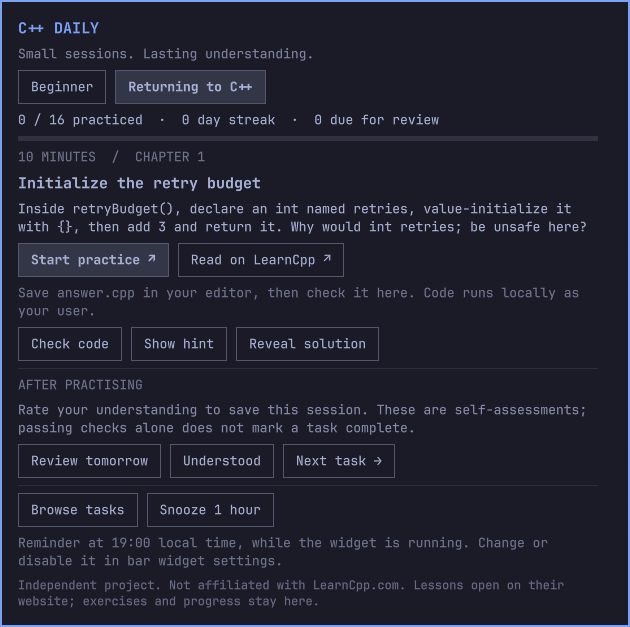

# C++ Daily

A native Omarchy bar widget for building a C++ practice habit. Open a short
exercise, write code in your editor, check it, and come back for a spaced review.
Free, open source, no account, subscription, API key, or telemetry.



## What is included

- 100 original exercises with hints, explanations, reference solutions, and C++20 checks.
- **Beginner**: two introductory function exercises followed by the core practice pack.
- **Returning to C++**: 98 exercises, starting with a 16-task recap through function overloading and default arguments.
- Links to relevant **LearnCpp.com** explanations, opened in your browser.
- Local progress, a daily streak, task browsing, and spaced reviews.
- One daily reminder at a configurable local time (19:00 by default), with a one-hour snooze.
- Theme-aware popup, keyboard-accessible controls, and an editor shortcut.

The practice pack continues into strings, loops, templates, references, classes,
containers, and algorithms. See the [100-task curriculum](docs/curriculum.md).
It is not a complete C++ course or a replacement for LearnCpp. Beginners
should read the linked lessons and earlier prerequisites as needed.

## Install

Requires **Omarchy 4 / Quattro**, Python 3, `notify-send`, and GCC (`g++`) or Clang
(`clang++`) for compiler checks. Omarchy's default editor launcher is used.
Install missing packages using Omarchy's package menu.

```sh
omarchy plugin add https://github.com/dfrost90/omarchy-cpp-daily --enable
```

Click the **C++ logo** in the bar and choose a learning path. **Open editor** opens an
`answer.cpp` file. Supply the requested functions; the checker supplies `main()`.
Save, return to the widget, and choose **Check code**. Compiler errors and failed
assertions are shown in the popup. Existing `answer.cpp` and `README.md` files are never overwritten on reopening.
New exercise files are created atomically; symlinks and non-regular files are
refused, including symlinks in the exercise directory path. If a collision is
reported, inspect the named path and move it aside yourself before retrying.

Use the **Keep open** switch in the title row to pin the task while using your editor or the top bar.
The pinned panel stays visible when opening an exercise or reading link; use
**Close** (or Escape while focused) to dismiss it. Toggle Keep open off to return
to normal popup behavior. Clicking the bar icon also closes the pinned panel; opening it again retains the
Keep open setting. Pinning lasts for the current shell session.

Use **All tasks** to search titles and topics, browse eight exercises per page, or change learning paths. Additional details
are available in **About** and button tooltips.

**Explain** shows a short C++ explanation without revealing the solution.
Hints and solutions are optional. Reference solutions use indented, selectable
C++ code with syntax highlighting. When finished, choose **Review tomorrow** or
**Understood** to record your self-assessment, then **Next task**. A passing check
alone does not mark completion. Checks verify behavior and selected types, not
every style requirement or written explanation.

Review tomorrow schedules one day ahead. Understood starts at three days, doubles
on subsequent review days, and caps at 30 days. Repeated ratings on the same day
do not inflate the interval. Due reviews are suggested before new tasks. Browse
any task at any time, and switch paths without deleting existing progress.
A streak counts consecutive local calendar days with a recorded self-assessment;
yesterday's streak remains visible until today's opportunity has passed.

## Reminders and settings

Use Omarchy's bar widget settings to change **Daily practice reminder** and
**Reminder time (local HH:MM)**. Settings are inline in this widget's entry in
`~/.config/omarchy/shell.json`:

```json
{"id":"io.github.dfrost90.cpp-daily","reminders":true,"reminderTime":"19:00"}
```

Reminders run only while the widget is enabled and the desktop shell is running.
The widget checks once per minute, reminds at most once per local day, and skips
days already practised. If the machine wakes after the chosen time it can remind
on the next tick. Snooze allows another reminder after one hour. There is no
background system service or wake alarm.

Open the widget from a shortcut or terminal:

```sh
omarchy-shell io.github.dfrost90.cpp-daily toggle
```

## Data and execution

Progress is saved atomically under `$XDG_DATA_HOME/cpp-daily/progress.json`
(default `~/.local/share/cpp-daily/progress.json`). Exercises live alongside it in
`exercises/<task-id>/answer.cpp`. Back up that directory to keep your work and
history. A damaged progress file produces an error rather than silently resetting
it. Progress is independent of the plugin checkout and survives plugin updates.

The plugin makes no network requests. Clicking a reading link opens LearnCpp in
your browser, subject to that website's own privacy policy. **Check code** compiles
and executes your local answer as your user, with compiler/runtime timeouts and
bounded output. It is not a security sandbox; only run code you trust. Nothing is
compiled or run merely by opening the widget or installing it.

## Remove

```sh
omarchy plugin disable io.github.dfrost90.cpp-daily
omarchy plugin remove io.github.dfrost90.cpp-daily
```

Disabling stops reminders. Removal leaves your progress and exercises intact.
Delete the `cpp-daily` data directory separately only if you want to erase them.

## Content and attribution

C++ Daily is independent and **not affiliated with or endorsed by LearnCpp.com**.
Exercises, hints, tests, and solutions are original project content licensed under
MIT along with the plugin. LearnCpp lessons are external reading references;
no lesson text, quizzes, images, or solutions are bundled, scraped, or cached.
The MIT license does not cover the linked website's material.

LearnCpp's [FAQ](https://www.learncpp.com/cpp-tutorial/introduction-to-these-tutorials/)
allows private offline copies but disallows distributing them. This project sends
readers to the original site. See [content policy](docs/content-policy.md).

## Develop and contribute

```sh
python3 -m unittest discover -s tests -v
omarchy plugin validate .
```

Tests compile every reference solution, reject unfinished starters, and exercise
review scheduling, streaks, reminder deduplication, corruption handling, and timeout
cleanup. They use temporary data directories and do not modify your learning record.

Add original tasks to `content/tasks.json` with a stable ID, prompt, hint,
explanation, starter, solution, assertion tests, and relevant external reading URL.
Keep URLs as references only. Stable task IDs preserve progress across releases.
Do not submit copied or lightly paraphrased LearnCpp exercises. See
[CONTRIBUTING.md](CONTRIBUTING.md).
